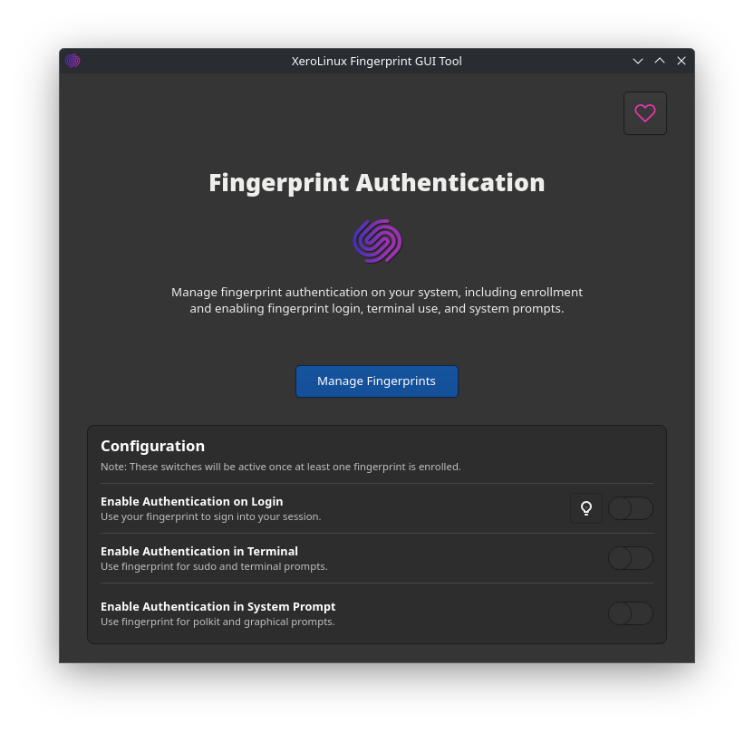
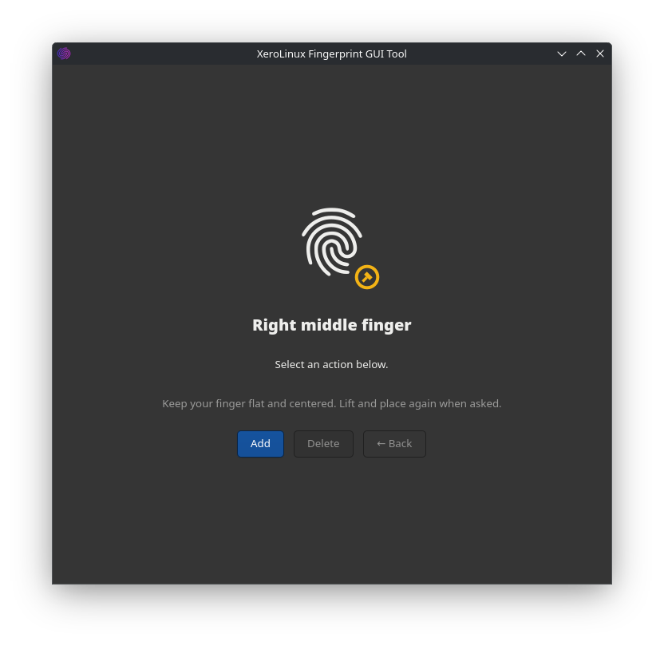
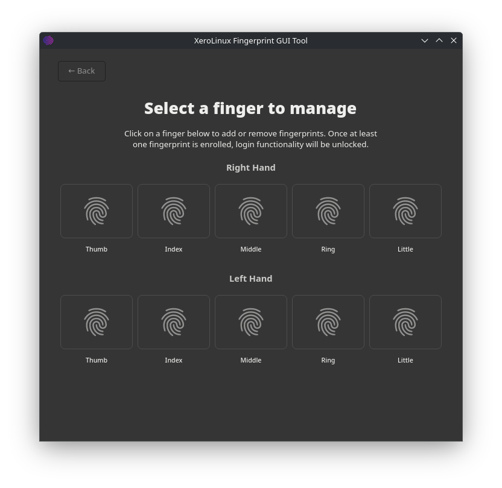

# 🔒 XeroLinux Fingerprint GUI Tool

A simple graphical interface for managing fingerprint authentication on XeroLinux systems.

## 📸 Screenshots

*Main application window*

*Fingerprint enrollment and management interface*

*List of enrolled fingerprints*

## 🎯 What It Does

This tool lets you easily manage fingerprint authentication on your XeroLinux system through a clean, modern interface. You can:

- **Enroll new fingerprints** with real-time feedback during scanning
- **Remove existing fingerprints** safely
- **Configure where fingerprints work** - login screen, terminal, sudo commands
- **View all your enrolled fingerprints** in one place

## ⚙️ How It Works

The application is split into two parts:

- **GUI Application**: The main interface you interact with for managing fingerprints
- **Helper Tool**: Handles system-level changes that require admin privileges

When you enroll a fingerprint, you'll see live updates showing your progress:
- "Scan 1 captured. Lift your finger, then place it again..."
- "Scan 2 captured..."
- And helpful guidance if you need to adjust finger placement

## ✨ Features

- **Real-time feedback** during fingerprint enrollment
- **Smart retry guidance** when scans need improvement
- **Safe fingerprint removal** with confirmation dialogs
- **PAM configuration** for login, terminal, and sudo authentication
- **Modern GTK4 interface** that fits naturally in your desktop

## 💻 System Requirements

- **XeroLinux** (specifically designed for XeroLinux)
- **Fingerprint reader** connected to your system
- **fprintd service** running (usually automatic)

This tool is specifically designed for **XeroLinux only** and will not work on other Linux distributions.

## 📄 License

This project is licensed under the GNU General Public License v3.0 - see the [LICENSE](LICENSE) file for details.